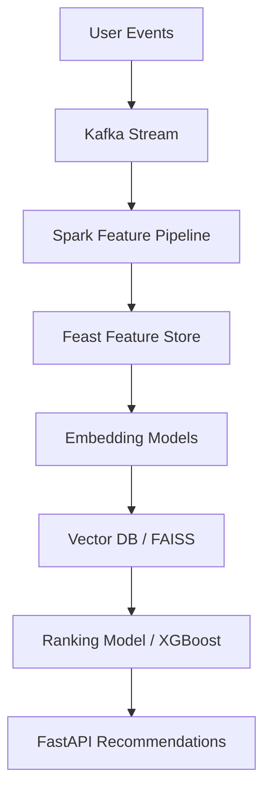

# Universal Recommendation Engine

A plug-and-play recommendation infrastructure that powers personalized content feeds (social media, e-commerce, articles, etc.) using a modern multi-stage architecture.



## Features
- **Real-time Event Streaming:** Captures interactions via Kafka.
- **Feature Engineering:** Processes streams using Apache Spark.
- **Feature Store:** Centralized ML features with Feast (Postgres + Redis).
- **Sub-linear Retrieval:** Fast nearest neighbor search with FAISS.
- **Advanced Ranking:** Sorting top candidates contextually with XGBoost.
- **Personalization API:** Low-latency REST API built on FastAPI.

## Prerequisites
- Docker & Docker Compose
- Python 3.10+

## Quickstart
1. Spin up the infrastructure:
   ```bash
   docker-compose up -d
   ```
2. Setup the python API and models (instructions to follow).
